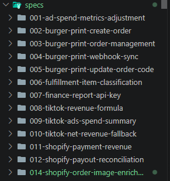
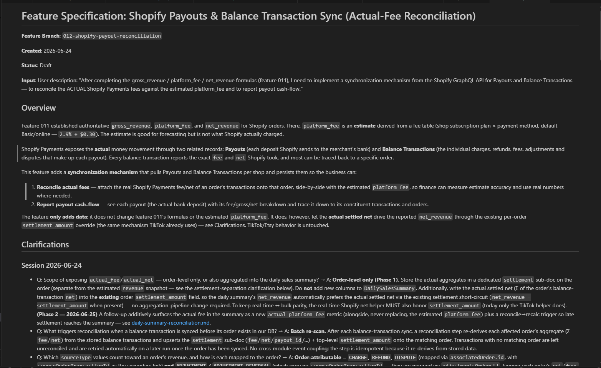
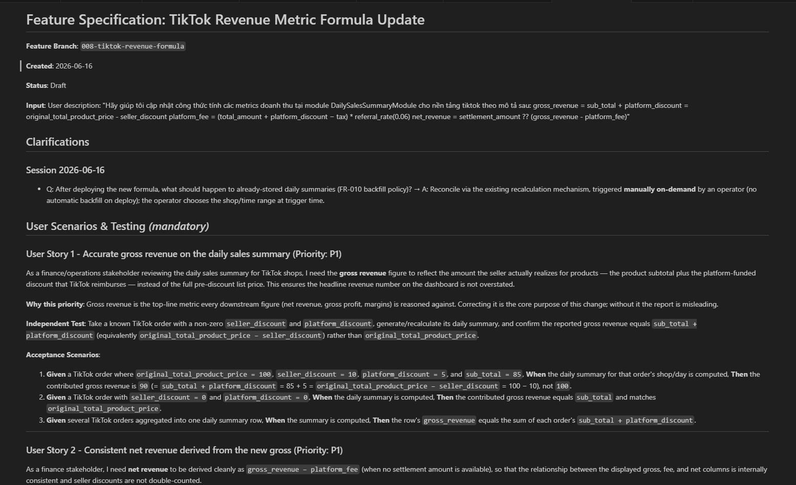
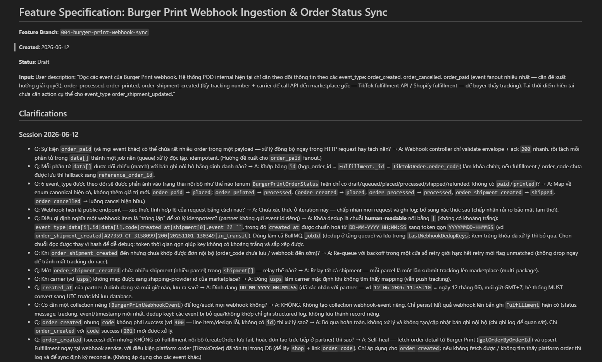
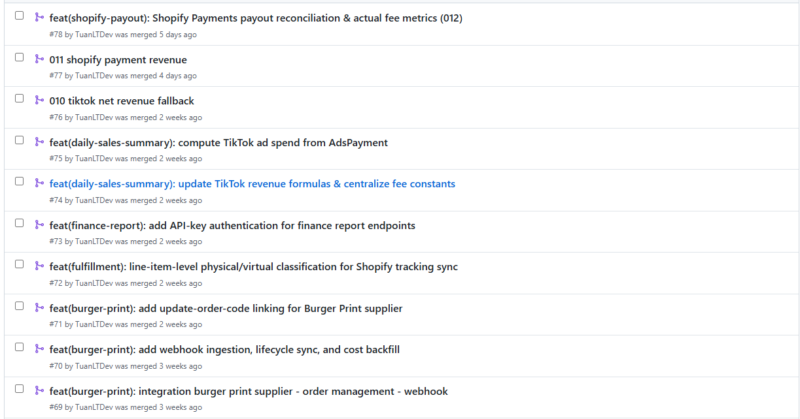
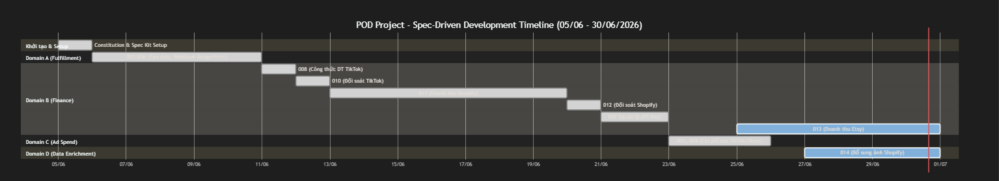
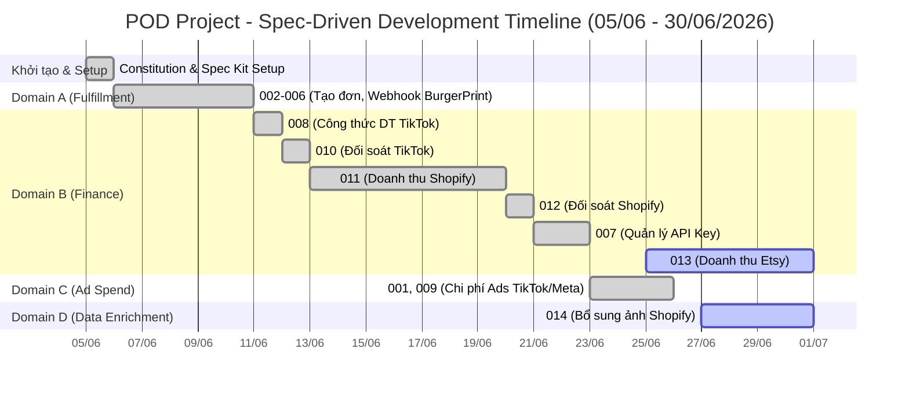

# Phụ lục 9: Minh chứng triển khai Spec-Driven Development

Tài liệu này tổng hợp các hình ảnh, video và liên kết chứng minh cho việc áp dụng Spec Kit vào dự án POD (tts-server).

---

## 1. Danh sách 14 Spec đã triển khai

_Mô tả: Hình ảnh chụp thư mục `specs/` trong repository `github.com/HungTMDev/tts-server`. Minh chứng cho thấy 12 spec đã merge (001–012), spec `013` đang trên branch riêng (`origin/013-etsy-revenue-estimate`) và spec `014` đang thực hiện._

---

## 2. Chi tiết các Spec tiêu biểu

_Mô tả: Minh chứng về mức độ chi tiết và chất lượng của các tài liệu spec được sinh ra thông qua quá trình phân tích với AI._

**A. Spec 012: Đối soát Shopify (1.303 dòng - chi tiết nhất)**

**B. Spec 008: Công thức doanh thu TikTok**

**C. Spec 004: Đồng bộ Webhook BurgerPrint**

---

## 3. Lịch sử Pull Requests (PRs)

_Mô tả: Hình ảnh lịch sử các PR được gắn chặt chẽ với từng spec, cho thấy luồng công việc rõ ràng từ spec đến code._
_(Bao gồm các PR: #69 (003), #70 (004), #71 (005), #72 (006), #73 (007), #74 (008), #75 (009), #76 (010), #77 (011), #78 (012))_

---

## 4. Biểu đồ Timeline Thực Tế (05/06 - 30/06/2026)

_Mô tả: Biểu đồ Gantt trực quan hóa quá trình triển khai 14 spec đa nền tảng (BurgerPrint, TikTok, Shopify, Etsy)._

# Timeline Triển Khai Spec-Driven Development (05/06/2026 - 30/06/2026)

Biểu đồ Gantt dưới đây minh họa tiến độ triển khai thực tế 14 spec của dự án POD, sử dụng công cụ GitHub Spec Kit. Bạn có thể chụp màn hình biểu đồ này để đính kèm vào mục 9 của hồ sơ dự thi.

> [!NOTE]
> **Chú thích:**
>
> - Các spec 008, 010, 012 hoàn thành rất nhanh trong khoảng ~1 ngày.
> - Spec lớn đa nền tảng 011 (Doanh thu Shopify) mất ~1 tuần.
> - Các spec 013 và 014 đang trong quá trình thực hiện (`active`).
